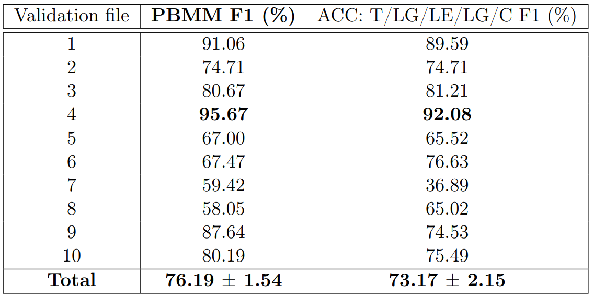

# News Segmentation Package - 0.2.4

This package takes subtitle VTT files (Video Text Track files) and extracts the piece of 
news from the whole newscast inside the file. News are stored into a Tree structure with useful NLP features inside. 
The user can specify their own algorithm for segmentation, however, there are some default. 

## About ##

Author: A.Palomo-Alonso (alberto.palomo@uah.es)\
Contributors: D.Casillas-Pérez, S.Jiménez-Fernández, A.Portilla-Figueras, S.Salcedo-Sanz.\
Universidad de Alcalá.\
Escuela Politécnica Superior.\
Departamento de Teoría De la Señal y Comunicaciones (TDSC).\
Cátedra ISDEFE.

## Architecture

The whole architecture and algorithms are described in depht in [this paper](https://???) or in 
[this master thesis](https://???).\
The architecture takes advantage of three main features in order perform news segmentation:
* Temporal distance: Is the distance (measured in jumps) between different pieces of text inside the VTT file.
* Spatial distance: Is the distance (measured in slots) between different pieces of text inside the VTT file.
* Semantical correlation: Is the correlation between the meaning of the sentences of two different pieces of text.

This architecture works with a _correlation matrix_ formed by the semantical correlation between each sentence 
in the news broadcast. Each module modifies the correlation matrix in order to apply temporal / spatial features 
reflected in the matrix. The algorithms shall be able to identify each piece of news inside the matrix.
Three differentiated modules make up the architecture:

* **Database Transformer (DT)**: Takes the original VTT file and converts it to plain text sentences (TXT) with time jumps specified 
at the begining of each sentence and a temporal information vector at the end pointing the temporal 
lenght of each sentence measured in seconds. 
* **Specific language model (SLM)**: This module takes the blocks of text as input and outputs the semantical correlation 
between each block of text arranged into a _correlation matrix_.
* **Temporal Distance Manager (TDM)**: This module takes the temporal jumps as input and modifies the initial correlation matrix
depending on the temporal jumps.
* **Spatial Distance Manager (SDM)**: This module implements an algorithm which identifies boundaries between 
consecutive pieces of text and merges it.
* **Late correlation manager (LCM)**: This module implements an algorithm which identifies 
high semantical correlation between separate pieces of text and merges it.

The user can implement their own algorithms depending on their application.\
\

\
The results are stored into a Tree structure with different fields representing different features from 
the piece of news.
* **Payload**: defines the whole text of the piece of news, it involves all sentences related to a same piece of news combined into a single piece of text. It can be defined as a text structure.
* **Embedding**: it is a vector of real numbers which define a semantic representation of the payload. In this model, it is the output of the SLM, output of the specific language model. It can be defined as a high dimensional vector of real numbers. This embedding is stored for computational efficiency reasons, as some models may take long time to compute.
* **ID**: it is a natural number defining the tree identity, this number must be unique for each tree in the results storage. It can be defined as a natural number. 
* **Time information**: it is a vector containing the whole temporal length of the piece of news. It can be defined as a real positive number.
* **Correlation power (CP)**: it is a real number indicating how correlated the sentences of the leafs are within the tree. This number can become very interesting when studying the reliability of algorithms. It can be defined as a real positive number.
Where M is the size of R1+K and R is, in our architecture, the very last output matrix R1+K. This function does not take into account the main diagonal of the correlation matrix as it does not provide any information about the correlation between sentences. The correlation power is defined on the (0, 1) interval, meaning 0 no correlation between any sentence in the tree and 1 meaning absolute correlation between all the sentences within the tree. This measurement helps to evaluate the reliability of the model.

* **Reference**: when several trees share the same results storage system, it is convenient to define a group of trees which make reference to a group. For example, if an analysis for several days when some piece of news can be repeated and those trees are lately merged into a subsequent tree, it is convenient to reference the day those trees belongs to. It can be done by its reference field, and it can be defined as a natural number. 
* **Leafs**: this structure stores information about the initial state of the model. Each leaf stores a unique _ID_ value and a _Payload_ value containing the minimum text size element considered; in this architecture this element is a sentence, but a single word or any group of words could be also considered.

## Usage

First, install the python package. After this, you can use your VTT files to get the 
news. Any other type of file can be considered, but the user must implement their own database
transformer according to the file and language used. Spanish news segmentation is the default model.

### Install:

You can install the package via pip:

    pip install newsegmentation -r requirements.txt

If any error ocurred, try installing the requirements before the installation:

    numpy
    matplotlib
    googletrans == 4.0.0rc1
    sentence_transformers >= 2.2.0
    sklearn
    nltk

### Basic Usage:

In this demo, we extract the news inside the first 5 minutes of the VTT file:

    $ python
    >>> import newsegmentation as ns
    >>> myNews = ns.Segmentation(r'./1.vtt')
    >>> print(myNews)

    NewsSegmentation object: 8 news classified.

    >>> myNews.info()

    News segmentation package:
    --------------------------------------------
    FAST USAGE:
    --------------------------------------------
    PATH_TO_MY_FILE = <PAHT>
    import newsegmentation as ns
    news = ns.NewsSegmentation(PATH_TO_MY_FILE)
    for pon in news:
        print(pon)
    --------------------------------------------

    >>> myNews.about()

    Institution:
    ------------------------------------------------------
    Universidad de Alcalá.
    Escuela Politécnica Superior.
    Departamento de Teoría De la Señal y Comunicaciones.
    Cátedra ISDEFE.
    ------------------------------------------------------
    Author: Alberto Palomo Alonso
    ------------------------------------------------------

    >>> for pieceOfNews in myNews:
    >>>     print(pieceOfNews)

    No hay descanso. Desde hace más de 24 horas se trabaja sin tregua para encontrar a Julen. El niño de 2 años se cayó en un pozo en Totalán, en Málaga. Las horas pasan, los equipos de rescate luchan contrarreloj y buscan nuevas opciones en un terreno escarpado y con riesgo de derrumbes bajo tierra. Buenas noches. Arrancamos este Telediario, allí, en el lugar del rescate. ¿Cuáles son las opciones para encontrar a Julen? Se trabaja en 3 frentes retirar la arena que está taponando el pozo de prospección. Excavar en 2 pozo, y abrir en el lateral de la montaña
    El objetivo rescatar al pequeño. El proyecto de presupuestos llega al Congreso. Son las cuentas con más gasto público desde 2010 Destacan más partidas para programas sociales, contra la pobreza infantil o la dependencia, y también el aumento de inversiones en Cataluña. El gobierno necesita entre otros el apoyo de los independentistas catalanes que por ahora mantienen el NO a los presupuestos, aunque desde el ejecutivo nacional se escuchan voces más optimistas
    La familia de Laura Sanz Nombela, fallecida en París por una explosión de gas espera poder repatriar su cuerpo este próximo miércoles. Hemos hablado con su padre, que está en Francia junto a su yerno y nos ha contado que se sintieron abandonados en las primeras horas tras el accidente. La guardia civil busca en una zona de grutas volcánicas de difícil acceso el cuerpo de la joven desaparecida en Lanzarote, Romina Celeste. Su marido está detenido en relación con su muerte aunque él defiende que no la mató, que solo discutieron y que luego se la encontró muerta la noche de Año Nuevo
    Dormir poco hace que suba hasta un 27 por ciento el riesgo de enfermedades cardiovasculares
    Es la conclusión de un estudio que ha realizado durante 10 años el Centro Nacional para estas dolencias
    Y una noticia de esta misma tarde de la que estamos muy pendientes: Un tren ha descarrilado esta tarde cerca de Torrijos en Toledo sin causar heridos. Había salido de Cáceres con dirección a Madrid. Los 33 pasajeros han sido trasladados a la capital en otro tren. La circulación en la vía entre Madrid y Extremadura está interrumpida. Renfe ha organizado un transporte alternativo en autobús para los afectados
    A 15 días de la gran gala de los Goya hoy se ha entregado ya el primer premio. La cita es el próximo 2 de febrero en Sevilla, pero hoy, aquí en Madrid, en el Teatro Real gran fiesta de los denominados a los Premios Goya. Solo uno de ellos se llevará hoy su estatuilla. Chicho Ibáñez Serrador consigue el Premio Goya de Honor por toda una vida dedicada al cine de terror
    Y en los deportes Nadal gana en Australia, Sergio

    >>> myNews.plotmtx()

### Finding news from text:

You can also find information inside the news using the method whereis():
    
    >>> myNews.whereis('Nadal')

    [7]

    >>> myNews.whereis('2')

    [0, 1, 3, 6]

### Evaluate performance:

If you can create a tree from any ground truth database, this package also has a method por evaluation:
    
* First, you have to import a custom ground truth / golden data tree with _gtreader_:

 

    >>> from newsegmentation import gtreader
    >>> myGt = gtreader('path.txt')
    
* Then evaluate the news with the reference, use the argument show=True to plot some graphics about the evaluation:
 

    >>> myNews.evaluate(myGt, show=True)
  

### Custom Algorithms:

Implement the abstract class NewSegmentation for implementing custom algorithms, use this demo as a template:

    import newsegmentation as ns

    class MySegmentation(ns.NewsSegmentation):
        @staticmethod
        def _spatial_manager(r, param):
            # return ns.default_sdm(r, param)
            return myown_sdm(r, param)
    
        @staticmethod
        def _specific_language_model(s):
            # return ns.default_slm(s)
            return myown_slm(s)
    
        @staticmethod
        def _later_correlation_manager(lm, s, t, param):
            # return ns.default_lcm(lm, s, t, param)
            return myown_lcm(lm, s, t, param)
    
        @staticmethod
        def _database_transformation(path, op):
            # return ns.default_dbt(path, op)
            return myown_dbt(path, op)

Note that _ns.default_xxx_ is the default manager for the architecture and can be replaced by your own functions. 
Take into account the following constraints before implementing your own module managers:

* SDM: Takes as input the correlation matrix (r) and the algorithm parameters (param). It returns a list of integers 
pointing the index of the block in (r) where each pieces of news start.
* SLM: Takes as input the list of sentences and returns the embeddings of the sentence. For further information about 
word embeddings check the master thesis cited.
* LCM: Takes as input the SLM function reference (lm), the list of sentences (s), the temporal information vector (t) 
and the algorithm parameters (param). It returns (rk, sk, tk): the very last correlation matrix (rk), the last blocks of
text (sk) and their corresponding temporal information (tk). Note that you dont need to manage the embeddings, the SLM works on that job.
* DT: Takes as input (path) the path of the VTT file and the requested output path (op) returns the actual output path.
Note that the architecture creates temporary TXT files for reading the news from the DT.
## Performance

Comparing two different algorithms inside the architecture. LGA is a kernel-based algorithm with cellular automation techniques. PBMM algorithm is 
the default algorithm and has better F1 score performance and reliability. This is tested over a Spanish news boradcast database with 10 files.

### Cite as:
~~~
@inproceedings{newsegmentation,
  title={News Segmentation Architecture for NLP},
  author={A.Palomo-Alonso, D.Casillas-Pérez, S.Jiménez-Fernández, A.Portilla-Figueras, S.Salcedo-Sanz},
  booktitle={Master Thesis in Telecommunication Engeneering},
  year={2022}
}
~~~